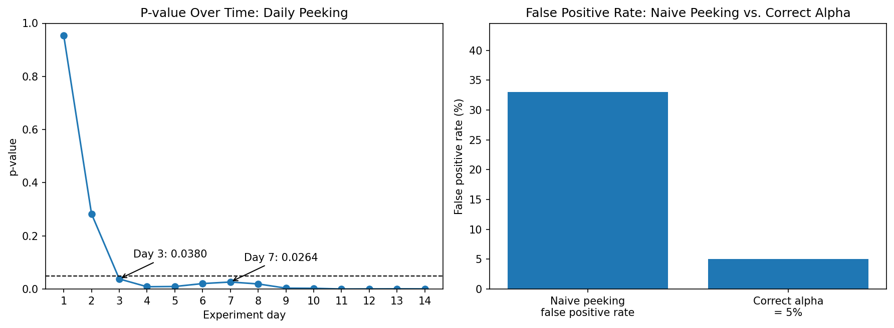
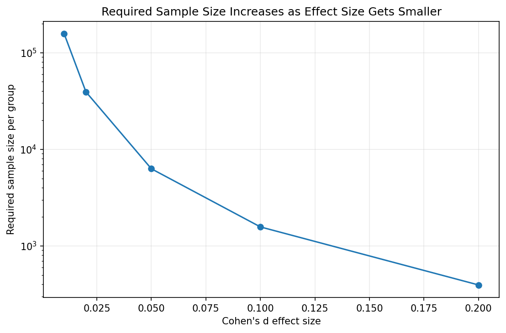
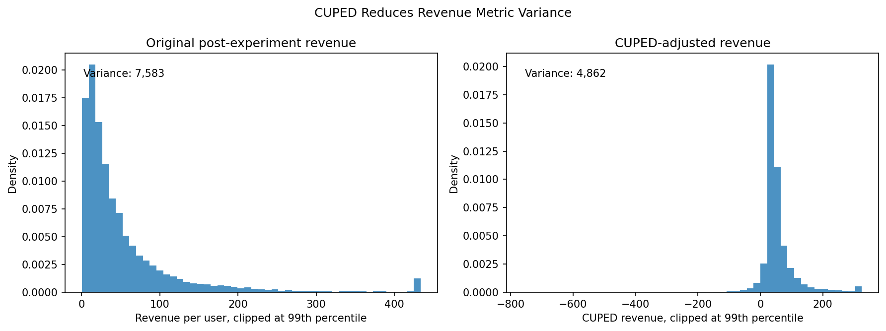
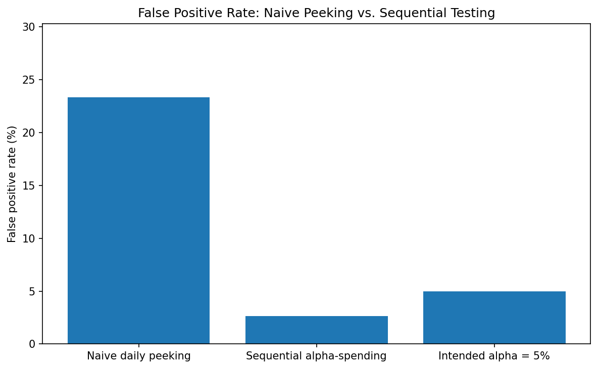
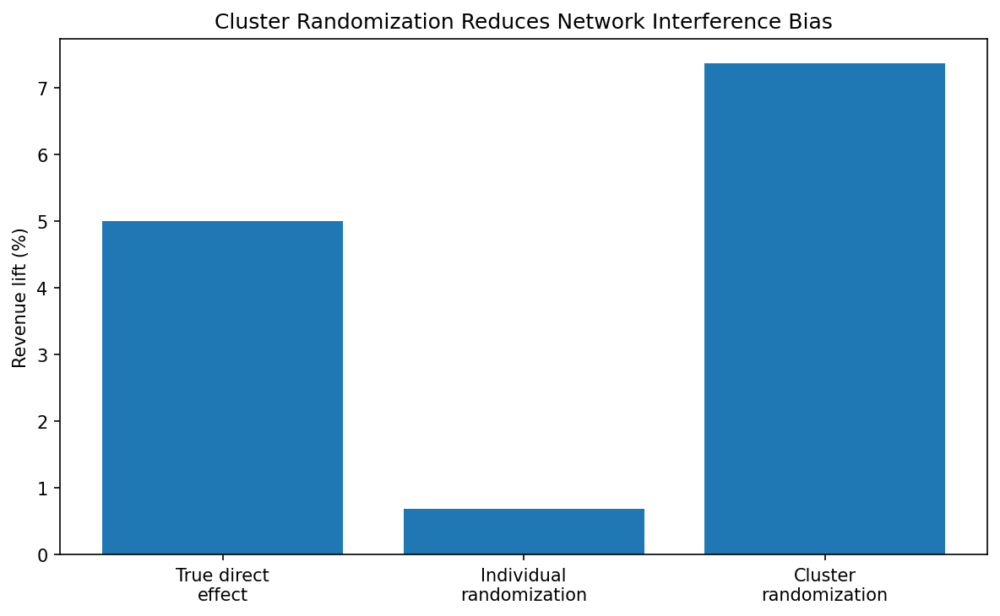
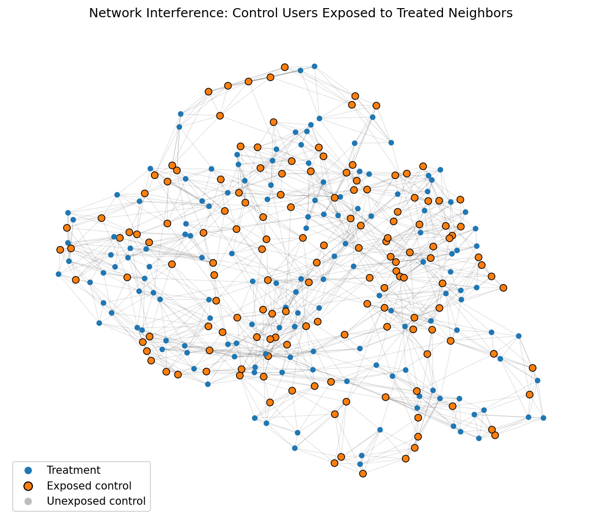

# ExperimentSim — A/B Testing Pitfall Detection and Correction Framework

ExperimentSim simulates an e-commerce company testing whether a new recommendation algorithm increases revenue per user. The project shows why naive A/B testing can fail in production: revenue is skewed, analysts may peek early, users can be randomized incorrectly, CUPED can reduce metric variance, sequential testing is needed for defensible early stopping, and network interference can contaminate estimates when users influence each other.

## Why This Project Matters

Most candidates say they know A/B testing. This project demonstrates where naive testing breaks and how production data science teams correct it with stronger statistical design, practical interpretation, and business-aware diagnostics.

## Current Status

The statistical modules and Streamlit dashboard are complete. Final future polish may include additional automated tests and deployment.

## Dashboard Preview / How To Run

```bat
python -m venv venv
venv\Scripts\activate
pip install -r requirements.txt
python -m streamlit run dashboard\app.py
```

Note: On Windows, use `venv\Scripts\activate`. On macOS/Linux, use `source venv/bin/activate`.

Then open:

```text
http://localhost:8501
```

The dashboard lets users adjust sample size, treatment lift, duration, CUPED, sequential testing, and random seed to explore the experimentation concepts interactively.

## Project Structure

```text
data/              Synthetic user-level revenue simulation
modules/           Experimentation failure and correction modules
dashboard/         Streamlit dashboard for interactive exploration
outputs/figures/   Generated figures used in the README and dashboard
tests/             Placeholder for statistical utility tests
README.md          Project documentation
requirements.txt   Python dependencies
```

## Module Summary

| Module | Problem demonstrated | Correct method | Output figure |
|---|---|---|---|
| Module 1 — Naive analyst failures | Peeking, bad randomization, skewed revenue | Planned analysis, user-level randomization, robust interpretation | `outputs/figures/m1_peeking.png` |
| Module 2 — Correct statistical foundations | Misreading p-values and underpowered tests | Mann-Whitney U, power analysis, Cohen's d | `outputs/figures/m2_power_analysis.png` |
| Module 3 — CUPED variance reduction | Noisy revenue metrics hide real effects | CUPED adjustment using pre-experiment revenue | `outputs/figures/m3_variance_reduction.png` |
| Module 4 — Sequential testing | Naive daily peeking inflates false positives | Educational alpha-spending sequential correction | `outputs/figures/m4_false_positive_comparison.png` |
| Module 5 — Network interference | Treated users influence control users | Cluster randomization and interference diagnostics | `outputs/figures/m5_cluster_correction.png` |

## Key Findings

**Module 1 — Naive analyst failures**

- Naive daily peeking inflated the false positive rate to about **33.0%** in one simulation set.
- Revenue skewness was about **6.25** before log transform and about **0.17** after log transform.

**Module 2 — Correct statistical foundations**

- Required sample size per group:
  - `d = 0.01`: **156,979**
  - `d = 0.02`: **39,246**
  - `d = 0.05`: **6,281**
  - `d = 0.10`: **1,571**
  - `d = 0.20`: **394**
- Demonstrated `p < 0.05` with tiny Cohen's d around **0.0127**, showing statistical significance can be practically negligible.

**Module 3 — CUPED variance reduction**

- CUPED reduced variance by about **35.88%**.
- CUPED reached significance earlier in the dashboard demo: **day 4 with CUPED** vs **day 10 without CUPED**.

**Module 4 — Sequential testing**

- Naive peeking false positive rate: **23.3%**
- Sequential alpha-spending false positive rate: **2.7%**
- Target alpha: **5.0%**
- The sequential method here is an educational alpha-spending correction, not a full production-grade group sequential design.

**Module 5 — Network interference**

- Average treated-neighbor share among control users: about **0.506**
- Individual randomization estimated lift: about **0.69%**
- Cluster randomization estimated lift: about **7.37%**
- True direct treatment effect: **5.0%**

## Figures













## Statistical Concepts Covered

- False positive inflation from peeking
- Mann-Whitney U for skewed revenue
- Power analysis
- Cohen's d and practical significance
- CUPED variance reduction
- Sequential alpha-spending
- Network interference
- Cluster randomization

## Interview Questions This Project Answers

**Why Mann-Whitney instead of only a t-test?**  
Revenue per user is usually right-skewed because a small number of customers spend much more than everyone else. A t-test can still be useful, but Mann-Whitney U gives a rank-based comparison that is less sensitive to extreme revenue outliers.

**What is CUPED and why does it help?**  
CUPED uses pre-experiment behavior to explain predictable variation in the experiment metric. In this project, past revenue predicts future revenue, so adjusting for it reduces noise and makes true effects easier to detect.

**What is the peeking problem?**  
Peeking happens when analysts repeatedly check results and stop as soon as `p < 0.05`. Each look creates another chance to find significance by noise, which inflates false positives.

**How does sequential testing fix peeking?**  
Sequential testing plans the stopping rule before the experiment starts. This project uses an educational alpha-spending rule where early looks use stricter thresholds than naive `p < 0.05`.

**What is network interference?**  
Network interference occurs when one user's treatment affects another user's outcome. In e-commerce, this can happen through shared purchases, recommendations, households, or social influence.

**Why use cluster randomization?**  
Cluster randomization assigns connected users together so treated users are less likely to spill over into the control group. This makes the comparison more defensible when users influence each other.

**What is statistical vs practical significance?**  
Statistical significance asks whether an effect is likely to be real under a model. Practical significance asks whether the effect is large enough to matter for the business.

## What I Learned

This project strengthened my understanding of production experimentation beyond textbook A/B testing. I practiced diagnosing false positives, controlling error rates, reducing variance with pre-experiment covariates, and interpreting results in business terms rather than stopping at p-values. It also reinforced why experiment design choices, such as randomization unit and stopping rules, can matter as much as the statistical test itself.

## Resume Bullet

- Built an end-to-end A/B testing simulation framework exposing experimentation pitfalls in e-commerce recommendation testing — implemented CUPED variance reduction achieving ~35.9% lower metric variance, sequential testing reducing false positives from 23.3% to 2.7%, and network interference detection via cluster randomization across 10,000+ simulated users.
